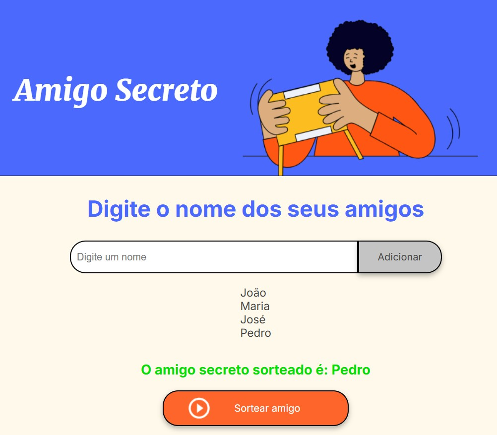

# Amigo Secreto

O projeto **Amigo Secreto** é uma aplicação simples e interativa para realizar sorteios de amigo secreto. Os usuários podem adicionar nomes de amigos e, com um clique, realizar o sorteio de quem será o amigo secreto de cada participante.

## Funcionalidades

- **Adicionar amigos**: Os usuários podem inserir os nomes dos amigos que participarão do sorteio.
- **Sorteio do amigo secreto**: Após adicionar os nomes, o usuário pode realizar o sorteio, e o nome do amigo secreto sorteado será exibido na tela.
- **Lista de participantes**: Os nomes dos amigos adicionados são mostrados em uma lista para acompanhamento.

## Tecnologias

- **HTML5**: Estrutura da página.
- **CSS**: Estilo visual (não detalhado aqui, mas presente no projeto).
- **JavaScript**: Funcionalidade do sorteio e manipulação da DOM.

## Como usar

1. **Adicionar nomes**: 
   - Digite o nome de um amigo na caixa de entrada e clique em "Adicionar".
   - O nome será adicionado à lista de participantes.
   
2. **Sortear amigo secreto**:
   - Após adicionar pelo menos um nome, clique no botão "Sortear amigo".
   - O nome do amigo secreto será sorteado aleatoriamente e exibido na tela.

